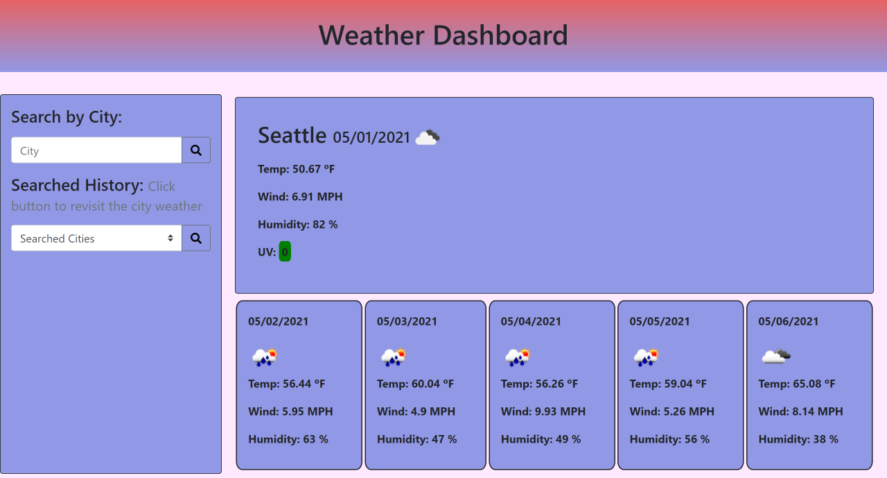
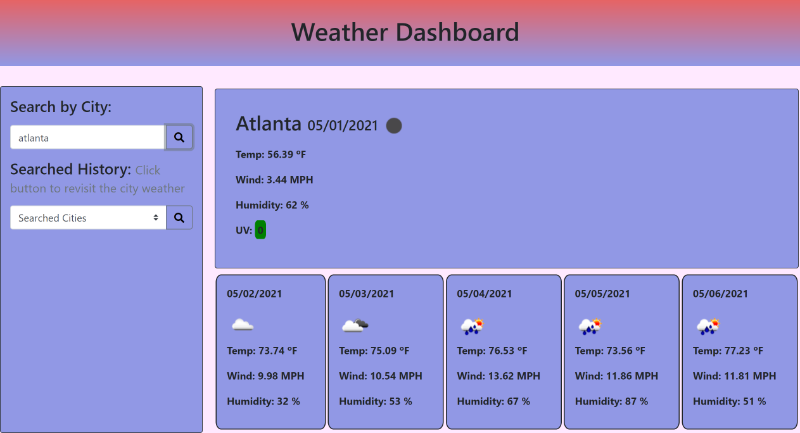

# Weather-Dashboard

Weather dashboard takes input from user as in form of city. When dashborad is opened it will display current weather and forecast for next five days for Seattle WA by default. When user enter a city name then user is presented with current and future conditions for that city and that city is added in the dropdown list as a searched history. In current weather display user is presented with a city name, the date, an icon representation of weather conditions, the temperature, the humidity, the wind speed, and the UV index. UV index is presented with a color that indicates whether the conditions are favorable (green), moderate (orange), or severe (red).  
If user entered invalid city name by mistake an alert is flashed saying Not found.If user didnt enter city name and search for weather then alert will pop up saying "Please enter a city name".  
Future weather conditions for that city is presented with a 5-day forecast that displays the date, an icon representation of weather conditions, the temperature, the wind speed, and the humidity.
When user selects a city from dropdown which is a list of all city serached and hit serach button then user is presented with the current and forecast (next 5 days) weather for that city with same parameters.If user didn't select any cities from dropdown list then alert will pop up saying "Please select an option".Weather dashboard app will run in the browser and feature dynamically updated HTML and CSS.

## Key Learning:

1. Server Side APIs.
2. jQuery,JS.
3. Usage of bootstrap for responsive web design.
4. local storage.
5. Usage of semantic HTML elements and logical structuring of web page.
6. Usage of Github (uploading and publishing on github).

## ScreenShot

## Main Page

## Page showcasing weather search results for Atlanta

## Deployed Application

[Weather Dashboard](https://gunjanb.github.io/Weather-Dashboard/)
